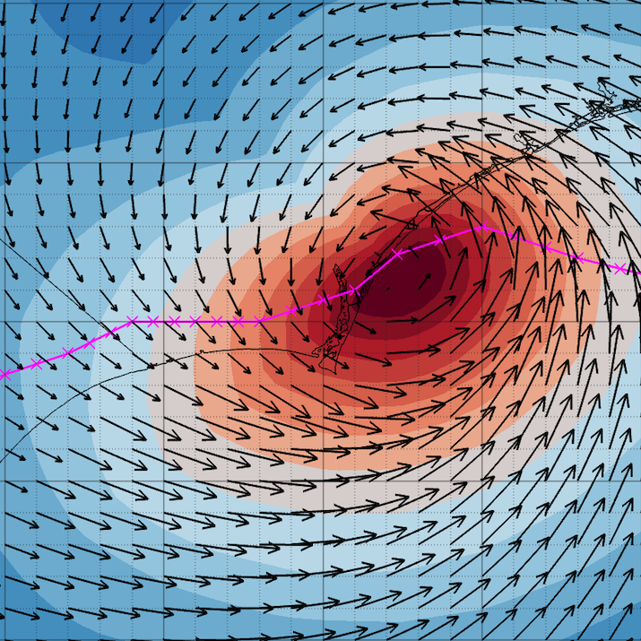

# GAHM2026 — Generalized Asymmetric Holland Model 

MATLAB codebase for computing hurricane wind and pressure fields using the Generalized Asymmetric Holland Model (GAHM). The process reads tropical cyclone track data, computes GAHM parameters, generates radial wind/pressure profiles, optionally blends with large-scale gridded environmental fields, and writes output to NetCDF.

When using gridded environmental fields (`env_info.type = 3`), **SeparateEnvHur** separates storm-scale features from ERA5 reanalysis data to produce the required environmental input. One configuration file specifies the complete pipeline. 

Developed by Rick Luettich (UNC/IMS/CNHR/EMES) and Brian Blanton (UNC/RENCI).

V1.5, Aug 2026

---

### Quick Start

```matlab
cd GAHM2026
R = run_GAHM2026;                          % uses default config/config_GAHM2026_default.m
R = run_GAHM2026('config_Florence');       % uses config/config_Florence.m
```

`run_GAHM2026` returns a `Result` struct containing all output fields (see [Output](#output) below). If the SeparateEnvHur `.mat` file does not exist (e.g., `output/FLORENCE_2018_AL06.mat`), it will automatically run SeparateEnvHur to generate it before proceeding.

### Plotting

```matlab
addpath('PlotEvalScripts')
obj = GAHM2026Plotter(R);
fig = obj.contourMap('mvelcon', 1, 20);                        % wind speed map at timestep 20
obj.radialProfile('velrad', 'envhur', 10, 10);                 % radial profiles at timestep 10
obj.radialProfile('velrad', {'envhur', 'trackdata'}, 10, 10);  % add track data to profiles
obj.animate('mvelcon', 1);                                     % animated GIF/MP4
```

See [`PlotEvalScripts/README.md`](PlotEvalScripts/README.md) for the full `GAHM2026Plotter` class reference.

### Running SeparateEnvHur separately

You can run SeparateEnvHur standalone using the same config file:

```matlab
cd GAHM2026
addpath('SeparateEnvHur')
env_vals = SeparateEnvHur('config/config_GAHM2026_default');  % default config
env_vals = SeparateEnvHur('config/config_Florence');          % storm-specific config
```

### Plotting SeparateEnvHur output

```matlab
addpath('PlotEvalScripts')
obj = GAHM2026Plotter.fromSepEnvHur(env_vals);

% combined env + hurricane wind field
obj.contourMap('mvelcon', 1, 5);

% environmental component only
obj.setOpts('wind', 'clims', [0 16]);
obj.contourMap('velcon', 2, 5, obj.EnvData);

% difference map: env minus hurricane wind speed
obj.differenceMap(obj.EnvData, obj.HurData, 'speed', 3, 5);
```

---

## Directory Layout

SeparateEnvHur lives inside the GAHM2026 directory:

```
GAHM2026/
├── run_GAHM2026.m             — top-level driver (returns Result struct)
├── GAHM2026.m                 — main GAHM2026 orchestrator
├── config/
│   ├── config_GAHM2026_default.m — default config (SeparateEnvHur + GAHM2026)
│   └── config_Florence.m      — example storm-specific config
├── util/                      — GAHM2026 pipeline functions and shared utilities
├── input/                     — track files (IBTrACS, ATCF, fort22)
├── output/                    — NetCDF output, warning logs
├── PlotEvalScripts/           — GAHM2026Plotter class and legacy plotting scripts
├── tools/                     — regression testing harness
├── documentation/             — derivation, call tree, data structures, config reference
├── docs/                      — GitHub Pages site
│
└── SeparateEnvHur/
    ├── SeparateEnvHur.m        — vortex scrubber entry point
    ├── getERA5Data.m           — ERA5 NetCDF reader (supports <year> placeholder)
    ├── findCutline.m           — wind threshold contour detection
    ├── computeBasicField.m     — environmental field separation
    ├── createOutputStruct.m    — package output .mat structure
    └── ...                     — additional processing functions
```

---

## Configuration

### Config file layout (`config/config_GAHM2026_default.m`)

Every config file has four sections. Storm identity parameters are defined once and shared by both SeparateEnvHur and GAHM2026. The driver validates that `storm_year` is consistent with `storm_start` and `storm_end` at startup.

#### 1. Shared storm identity

These values are defined as plain workspace variables and automatically populated into both the `sepenvhur` and `storm_info` structs:

| Variable | Description | Example |
|----------|-------------|---------|
| `storm_name` | Storm name (all caps for IBTrACS) | `'FLORENCE'` |
| `storm_year` | 4-digit year (numeric) | `2018` |
| `track_file` | IBTrACS CSV filename | `'ibtracs.NA.list.v04r01.csv'` |
| `storm_designation` | Basin + number | `'AL06'` |
| `storm_start` | Start time for processing (shared) | `datetime(2018,9,10,0,0,0)` |
| `storm_end` | End time for processing (shared) | `datetime(2018,9,12,0,0,0)` |

#### 2. SeparateEnvHur parameters (`sepenvhur.*`)

| Parameter | Description | Example |
|-----------|-------------|---------|
| `background_file` | ERA5 NetCDF input file path; use `<year>` as a placeholder for `storm_year` (resolved by `getERA5Data` at runtime) | `'/path/to/<year>/<year>.global.nc'` |
| `grid_half_size` | Half-size of extraction grid (grid points) | `40` |
| `output_half_size` | Half-size of output grid (grid points) | `40` |
| `filter_domain_size` | Domain size for Butterworth filter | `120` |
| `num_radial_points` | Radial points for polar interpolation | `1000` |
| `num_azimuth_points` | Azimuthal points | `360` |
| `max_radius_deg` | Maximum polar grid radius (degrees) | `10` |
| `wind_threshold_outer` | Outer cutline threshold (m/s) | `10` |
| `wind_threshold_inner` | Inner cutline threshold (m/s, 34 kt) | `34/1.944` |
| `debug` | Print debug messages | `true` |

> **Note:** `sepenvhur.storm_name`, `sepenvhur.storm_year`, `sepenvhur.storm_designation`, `sepenvhur.track_file`, `sepenvhur.storm_start`, and `sepenvhur.storm_end` are automatically populated from the shared variables — do not set them separately. Likewise, `storm_info.starttime` and `storm_info.endtime` are derived from `storm_start` and `storm_end`.

#### 3. GAHM2026 parameters

See [`documentation/README_config.md`](documentation/README_config.md) for full parameter documentation.

| Struct | Key parameters |
|--------|---------------|
| `storm_info` | `.track_file`, `.file_type`, start/end times (derived from shared variables) |
| `GAHM_param_info` | GAHM model constants (B limits, BLF, version, etc.) |
| `GAHM_compute_info` | Radial grid resolution (`ntheta`, `nr`, `delr`) |
| `WAF_info` | Wind Adjustment Factor flag and raster file |
| `env_info` | Environmental field type, taper settings |
| `output_info` | Output format, grid resolution, NetCDF path |

#### 4. Automatic linkage

The `env_info.file_name` is derived from the shared storm identity:

```matlab
env_info.file_name = sprintf('%s_%d', storm_name, storm_year);  % e.g. 'FLORENCE_2018'
```

This matches the output filename that SeparateEnvHur produces (`FLORENCE_2018.mat`), so the two projects are linked without any manual coordination.

---

## End-to-End: How It Works

When `run_GAHM2026` is called and `env_info.type == 3`:

1. It checks whether `<env_info.file_name>.mat` exists (e.g., `output/FLORENCE_2018_AL06.mat`). This mat file contains the environmental fields needed by GAHM2026.
2. If the file exists → proceeds directly to GAHM2026 computation.
3. If the file is missing → calls `SeparateEnvHur(sepenvhur)`, saves the `.mat` file, and continues to GAHM2026.

```
run_GAHM2026
  │
  ├── Load config → storm_info, sepenvhur, env_info, ...
  ├── Download IBTrACS if missing
  ├── Check for FLORENCE_2018.mat
  │     │
  │     └── Missing? ──► SeparateEnvHur(sepenvhur)
  │                         ├── Load ERA5 NetCDF
  │                         ├── Extract & filter vortex
  │                         └── Save FLORENCE_2018.mat
  │
  ├── GAHM2026 computation
  └── Write NetCDF output
```

---

## Creating a Config for a New Storm

1. Copy `config/config_GAHM2026_default.m` (or any existing storm config) to `config/config_<StormName>.m`.
2. Update the shared storm identity section:
   ```matlab
   storm_name        = 'MICHAEL';
   storm_year        = 2018;
   track_file        = 'ibtracs.NA.list.v04r01.csv';
   storm_designation = 'AL14';
   ```
3. Update `sepenvhur` with the path to the ERA5 data and the desired extraction time window.
4. Update `storm_start` and `storm_end` to set the processing time window (used by both SeparateEnvHur and GAHM2026).
5. Adjust any model parameters as needed.
6. Run:
   ```matlab
   >> run_GAHM2026('config_Michael')
   ```

---

## Input Data

### IBTrACS track file

Download from: https://www.ncei.noaa.gov/data/international-best-track-archive-for-climate-stewardship-ibtracs/v04r01/access/csv/

Place in `GAHM2026/input/`. If not found, `run_GAHM2026` will attempt to download it automatically.

### ERA5 reanalysis data

The configurations in the config directory point to ERA5 output downloaded and hosted on a THREDDS data server at RENCI.  These ERA5 NetCDF files contain variables `msl`, `u10`, `v10`, and `time` (or `valid_time`) with spatial extends that cover a typical ADCIRC grid for the northwest Atlantic Ocean, including the Gulf of Mexico. The URL to this data is 
```
'https://tdsres.apps.renci.org/thredds/dodsC/Datalayers/ERA5/regional/wna/uvp/<year>/<year>.wna.nc';
```
The file path is specified in `sepenvhur.background_file`. Use the `<year>` placeholder in the path to have it automatically replaced with `storm_year` at runtime.  Any model dataset can be used as long as the files contain at least the above-specified variables.  

The DDS for these files looks like this: 
```
Dataset {
    Grid {
     ARRAY:
        Int16 msl[time = 10248][latitude = 201][longitude = 201];
     MAPS:
        Int32 time[time = 10248];
        Float32 latitude[latitude = 201];
        Float32 longitude[longitude = 201];
    } msl;
    Grid {
     ARRAY:
        Int16 u10[time = 10248][latitude = 201][longitude = 201];
     MAPS:
        Int32 time[time = 10248];
        Float32 latitude[latitude = 201];
        Float32 longitude[longitude = 201];
    } u10;
    Float32 latitude[latitude = 201];
    Float32 longitude[longitude = 201];
    Int32 time[time = 10248];
    Grid {
     ARRAY:
        Int16 v10[time = 10248][latitude = 201][longitude = 201];
     MAPS:
        Int32 time[time = 10248];
        Float32 latitude[latitude = 201];
        Float32 longitude[longitude = 201];
    } v10;
} Datalayers/ERA5/regional/wna/uvp/1979/1979.wna.nc;
```

---

## Output

### Result struct (returned by `run_GAHM2026`)

Always present:

| Field | Contents |
|-------|----------|
| `Result.Trackdata` | Storm track with `.Rmax_t1`, `.Vmax_t1`, `.RQuad_t1`, quadrant info |
| `Result.GAHM_out` | Per-timestep GAHM solver output |
| `Result.VPrad` | Radial grid data: `.r`, `.theta`, `.VVor_bt(i)`, `.VVor_at(i)`, `.Env(i)`, `.EnvVor_bt(i)` |
| `Result.storm_info` | Storm identity (name, year, designation) |
| `Result.env_info` | Environmental field configuration |

When `output_info.type = "grid"`:

| Field | Contents |
|-------|----------|
| `Result.Reggrid_out` | Grid coordinates (`.Lon`, `.Lat`), `.datetime`, `.Mask1`, `.Mask2` |
| `Result.Reggrid_TC_out` | Final blended TC fields: `.VelU`, `.VelV` (m/s), `.Press` (mb) |
| `Result.Reggrid_Env_out` | Environmental fields: `.VelU`, `.VelV` (m/s), `.Press` (mb) |
| `Result.Reggrid_VVor_invtapHur_out` | GAHM vortex + inverse-tapered hurricane (`env_info.type = 3` only) |

When `output_info.type = "points"`:

| Field | Contents |
|-------|----------|
| `Result.Points_TC_out` | Point TC output: `.datetime`, `.Lon`, `.Lat`, `.U10`, `.V10`, `.Press` |
| `Result.Points_Env_out` | Point environmental output, same fields |
| `Result.Points_VVor_invtapHur_out` | GAHM vortex + inverse-tapered hurricane at points (`env_info.type = 3` only) |

### Gridded NetCDF output (`output_info.type = "grid"`)

A NetCDF file is written to `output/<storm>_<year>_<designation>.nc` (e.g.,  `FLORENCE_AL06_2018.nc`) containing:
- Combined TC wind and pressure fields (`Reggrid_TC_out`)
- Environmental fields (`Reggrid_Env_out`)
- Grid coordinates and timestamps (`Reggrid_out`)

### Point output (`output_info.type = "points"`)

MATLAB structs are returned in the `Result` struct with wind velocity (U10, V10) and pressure at specified lon/lat locations. Set `output_info.lon` and `output_info.lat` to equal-length vectors; output is computed at the corresponding pairs. No NetCDF file is written.

### Wind Adjustment Factor

`WAF_info.flag = true` applies a land-roughness wind adjustment to the vortex velocity before the environmental wind is added. Pressure is not adjusted. The file format depends on the output type:

| `output_info.type` | `WAF_info.file_name` | Read by |
|---|---|---|
| `"grid"` | GeoTIFF raster, one layer per wind direction | `util/applyWAFfromRaster.m` |
| `"points"` | MAT-file containing `WAF_points` | `util/applyWAFfromPoints.m` |

`WAF_points` is a struct array with scalar `.lon`, scalar `.lat`, and a `.WAF` vector of factors for evenly spaced wind directions, ordered clockwise from north starting at 0°. Wind direction is the direction the wind blows *from*. The point coordinates must match `output_info.lon`/`.lat` exactly; unmatched points raise an error.

### SeparateEnvHur intermediate output

The `.mat` file (e.g., `FLORENCE_2018_AL06.mat`) contains the `env_vals` struct with:
- Environmental fields: `env_msl`, `env_u10`, `env_v10`
- Hurricane fields: `hur_msl`, `hur_u10`, `hur_v10`
- Vortex masks: `Vortex_mask`, `Vortex_mask_inner`
- Grid coordinates: `Lo`, `La`
- Track positions: `BestTrack_lon/lat`, `min_pressure_center_lon/lat`

---

<!--## Backward Compatibility

| Scenario | What to do |
|----------|------------|
| Existing `.mat` file already generated | `run_GAHM2026` — skips SeparateEnvHur, runs GAHM2026 directly |
| New storm with auto-chaining | Copy the default config, update storm identity, and call `run_GAHM2026('config_<Storm>')` |-->

---

## Logging

All diagnostic output uses the `logMsg` utility (`util/logMsg.m`):

```matlab
logMsg(fid, 'INFO', 'step %d complete', i);
logMsg(fid, 'WARNING', 'Missing data at time %s', t);
logMsg(fid, 'ERROR', 'File not found: %s', fname);   % terminates via error()
logMsg(-1,  'DEBUG', 'grid=%dx%d', nx, ny);           % stdout only (fid=-1)
```

Messages are printed to stdout and optionally to a log file. The `ERROR` level logs the message and then calls `error()` to terminate execution. The caller name is determined automatically via `dbstack`. Both GAHM2026 and SeparateEnvHur use `logMsg` for all logging.

---

## Shared Utilities

GAHM2026 and SeparateEnvHur share the following utilities in `util/`:

| File | Purpose |
|------|---------|
| `readIBTrACS.m` | IBTrACS CSV parser (used by both projects) |
| `logMsg.m` | Standardized logging (`DEBUG`/`INFO`/`WARNING`/`ERROR`) |
| `computeRmaxTot.m` | Total Rmax from quadrant values |
| `quadrantUnitVectors.m` | Vortex/environmental unit vectors per quadrant |
| `thetaToQuadrantPair.m` | Map azimuth to bounding quadrant pair |
| `turnAngleDeg.m` | Boundary layer turning angle |
| `gahmPhysicalConstants.m` | Centralized physical constants |

---

## References

- See [`documentation/CALL_TREE.md`](documentation/CALL_TREE.md) for the full GAHM2026 execution trace.
- See [`documentation/GAHM_struct.md`](documentation/GAHM_struct.md) for the GAHM data structure definition.
- See [`documentation/README_config.md`](documentation/README_config.md) for the complete configuration parameter reference.
- See [`PlotEvalScripts/README.md`](PlotEvalScripts/README.md) for the GAHM2026Plotter class guide.
- See [`SeparateEnvHur/README.md`](SeparateEnvHur/README.md) for details on the vortex scrubbing algorithm.
