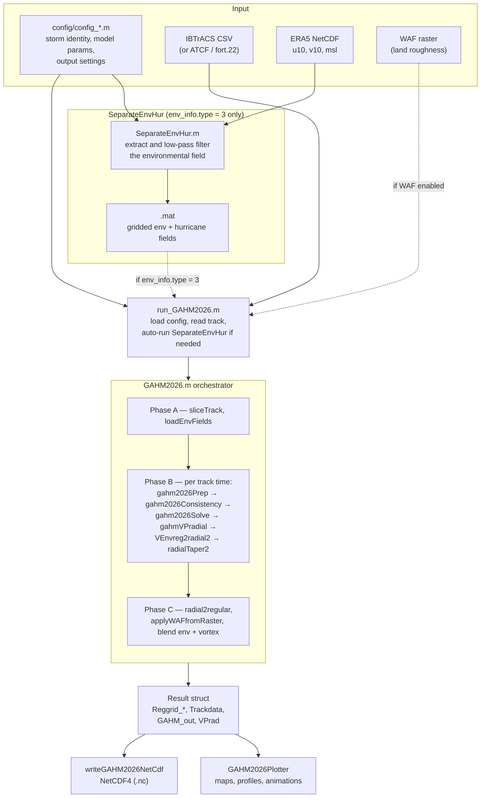

# GAHM2026

**Generalized Asymmetric Holland Model for tropical cyclone wind and pressure fields**
{: .fs-6 .fw-300 }

[Getting Started]({{ site.baseurl }}/getting-started/){: .btn .btn-primary .mr-2 }
[Derivation]({{ site.baseurl }}/derivation/){: .btn .mr-2 }
[View on GitHub](https://github.com/RENCI/GAHM2026){: .btn }

---

GAHM2026 is a MATLAB codebase for computing parametric hurricane wind and pressure fields.
Given tropical cyclone track data — best-track observations or forecasts — the model solves for
the Generalized Asymmetric Holland Model parameters at each track time, generates azimuthally
varying radial wind and pressure profiles, and interpolates them onto a regular longitude/latitude
grid for output.

Paired with the companion [SeparateEnvHur]({{ site.baseurl }}/separate-env-hur/) preprocessor,
GAHM2026 blends its parametric vortex into large-scale environmental fields extracted from
[ERA5 reanalysis]({{ site.baseurl }}/era5/), producing complete tropical cyclone wind and
pressure fields suitable for storm surge and coastal hazard modeling.

Developed by Rick Luettich (UNC/IMS/CNHR/EMES) and Brian Blanton (UNC/RENCI).

---

## Key features

- **Asymmetric wind profiles** — a separate Holland $B_g$ parameter and radius of maximum winds
  in each quadrant (NE, SE, SW, NW) at up to three isotach levels (34, 50, 64 kt).
- **Multiple track formats** — IBTrACS, ATCF, and [fort.22]({{ site.baseurl }}/track-files/);
  IBTrACS is downloaded automatically if not present.
- **Three environmental field options** — ADCIRC/ASWIP translation velocity, Lin & Chavas (2012),
  or a gridded ERA5-derived field from SeparateEnvHur.
- **Blending taper** — hyperbolic tangent taper across the hurricane/environment boundary.
- **Wind Adjustment Factor** — optional land-roughness correction from a GeoTIFF raster or
  precomputed point file.
- **NetCDF and point output** — a gridded NetCDF4 file, or evaluation at arbitrary lon/lat pairs.
- **Visualization toolkit** — the [`GAHM2026Plotter`]({{ site.baseurl }}/plotting/) class for
  contour maps, radial profiles, scatter comparisons, and GIF/MP4 animations.

---

## The model in one equation

GAHM extends the classic Holland (1980) pressure profile by carrying the Coriolis effect through
the gradient wind balance and letting the shape parameter $B_g$ vary by quadrant. The gradient
wind at the top of the boundary layer is

$$V_{g}(r) = \sqrt{V_{\max}^{2}\left( 1 + R_{o}^{-1} \right)\left( \frac{R_{mw}}{r} \right)^{B_{g}}e^{\varphi\left[ 1 - \left( \frac{R_{mw}}{r} \right)^{B_{g}} \right]} + \left( \frac{rf}{2} \right)^{2}} - \frac{rf}{2}$$

where $R_{o} = V_{\max}/(R_{mw} f)$ is the Rossby number and $\varphi$ follows from requiring
$dV_g/dr = 0$ at $r = R_{mw}$. Given central pressure, ambient pressure, maximum sustained wind,
and the radial distances to the 34/50/64 kt isotachs in four quadrants, the model solves for
$B_g$ and $R_{mw}$ in each quadrant.

Two solver backends are selectable through `GAHM_param_info.version`: version 3 (iterative, no
toolbox required) and version 4 (MATLAB `fsolve`, requires the Optimization Toolbox).

The full development, including the implementation details, default conditions, blending, and the
wind adjustment factor, is on the [Derivation of GAHM2026]({{ site.baseurl }}/derivation/) page.

---

## Pipeline



---

## Quick start

```matlab
cd GAHM2026
R = run_GAHM2026;                     % default config/config_GAHM2026_default.m
R = run_GAHM2026('config_Florence');  % config/config_Florence.m (no path, no .m)
```

See [Getting Started]({{ site.baseurl }}/getting-started/) for requirements and a first run that
needs no ERA5 data, and [Examples]({{ site.baseurl }}/examples/) for the shipped configurations.

---

## Documentation map

| Page | Contents |
|---|---|
| [Getting Started]({{ site.baseurl }}/getting-started/) | Requirements, first run, regression tests, common gotchas |
| [Derivation of GAHM2026]({{ site.baseurl }}/derivation/) | Full derivation, implementation, default conditions, blending, WAF |
| [Configuration]({{ site.baseurl }}/configuration/) | Every configuration parameter and output data structure |
| [ERA5 Data]({{ site.baseurl }}/era5/) | The reanalysis data GAHM2026 uses, and how to substitute your own |
| [Examples]({{ site.baseurl }}/examples/) | The shipped configurations and what each demonstrates |
| [Input Track Files]({{ site.baseurl }}/track-files/) | fort.22 formats read and written |
| [SeparateEnvHur]({{ site.baseurl }}/separate-env-hur/) | The vortex separation algorithm |
| [Plotting]({{ site.baseurl }}/plotting/) | The `GAHM2026Plotter` class |

---

## References

- Holland, G. J. (1980). An analytic model of the wind and pressure profiles in hurricanes.
  *Monthly Weather Review*, 108(8), 1212–1218.
- Gao, J. (2018). *Generalized Asymmetric Holland Vortex Model.* Ph.D. dissertation, Department of
  Marine Sciences, University of North Carolina at Chapel Hill.
- Lin, N. and Chavas, D. (2012). On hurricane parametric wind and applications in storm surge
  modeling. *Journal of Geophysical Research*, 117, D09120.
  [doi:10.1029/2011JD017126](https://doi.org/10.1029/2011JD017126)
- Wang, S., Lin, N., and Gori, A. (2021). Investigation of tropical cyclone wind models with
  application to storm tide simulations. *Journal of Geophysical Research: Atmospheres*.
  [doi:10.1029/2021JD036359](https://doi.org/10.1029/2021JD036359)

A complete reference list is at the end of the
[Derivation]({{ site.baseurl }}/derivation/#6-references) page.
