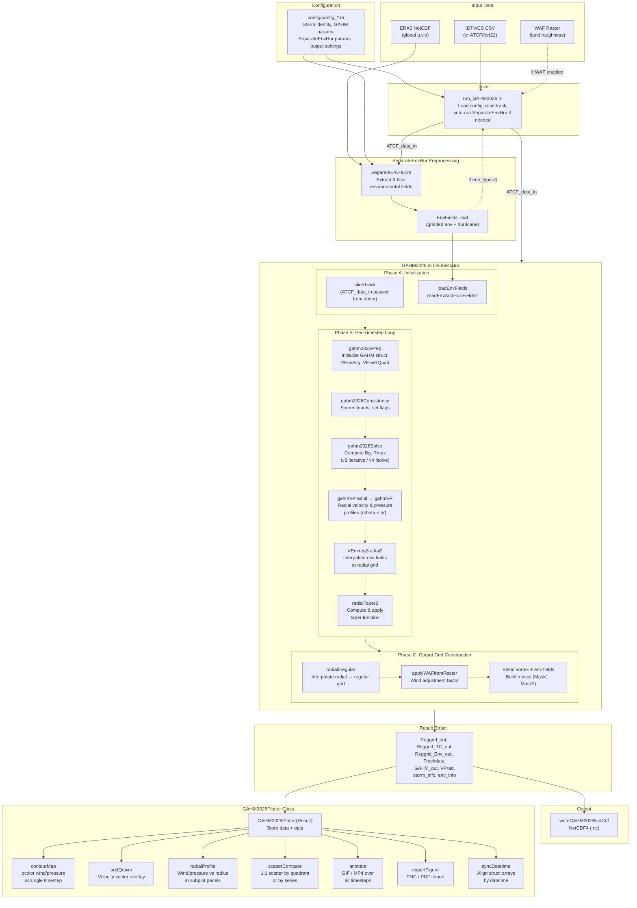

# GAHM2026 Project Workflow
## Generated: 2026-02-17
```
Render with: mmdc -i GAHM2026_workflow.mmd -o GAHM2026_workflow.png
Or view in any Mermaid-compatible viewer (GitHub, VS Code, etc.)
```


```mermaid

flowchart TB
    subgraph CONFIG["Configuration"]
        CONFIG_node["config/config_*.m\nStorm identity, GAHM params,\nSeparateEnvHur params, output settings"]
    end

    subgraph INPUT["Input Data"]
        ibt["IBTrACS CSV\n(or ATCF/fort22)"]
        era5["ERA5 NetCDF\n(global u,v,p)"]
        waf["WAF Raster\n(land roughness)"]
    end

    subgraph SCRUB["SeparateEnvHur Preprocessing"]
        scrub["SeparateEnvHur.m\nExtract & filter\nenvironmental fields"]
        envmat["EnvFields .mat\n(gridded env + hurricane)"]
    end

    subgraph DRIVER["Driver"]
        run["run_GAHM2026.m\nLoad config, read track,\nauto-run SeparateEnvHur if needed"]
    end

    subgraph GAHM["GAHM2026.m  Orchestrator"]
        direction TB

        subgraph INIT["Phase A: Initialization"]
            track["sliceTrack\n(ATCF_data_in passed from driver)"]
            loadenv["loadEnvFields\nreadEnvAndHurrFields2"]
        end

        subgraph LOOP["Phase B: Per-Timestep Loop"]
            direction TB
            prep["gahm2026Prep\nInitialize GAHM struct,\nVEnvAvg, VEnvRQuad"]
            consist["gahm2026Consistency\nScreen inputs, set flags"]
            solve["gahm2026Solve\nCompute Bg, Rmax\n(v3 iterative / v4 fsolve)"]
            radial["gahmVPradial → gahmVP\nRadial velocity & pressure\nprofiles (ntheta × nr)"]
            envrad["VEnvreg2radial2\nInterpolate env fields\nto radial grid"]
            taper["radialTaper2\nCompute & apply\ntaper function"]
            prep --> consist --> solve --> radial --> envrad --> taper
        end

        subgraph OUTPUT_GRID["Phase C: Output Grid Construction"]
            r2r["radial2regular\nInterpolate radial → regular grid"]
            wafapp["applyWAFfromRaster\nWind adjustment factor"]
            blend["Blend vortex + env fields\nBuild masks (Mask1, Mask2)"]
            r2r --> wafapp --> blend
        end

        INIT --> LOOP --> OUTPUT_GRID
    end

    subgraph RESULT["Result Struct"]
        res["Reggrid_out, Reggrid_TC_out,\nReggrid_Env_out, Trackdata,\nGAHM_out, VPrad,\nstorm_info, env_info"]
    end

    subgraph WRITE["Output"]
        nc["writeGAHM2026NetCdf\nNetCDF4 (.nc)"]
    end

    subgraph PLOT["GAHM2026Plotter Class"]
        direction TB
        ctor["GAHM2026Plotter(Result)\nStore data + opts"]
        con["contourMap\npcolor wind/pressure\nat single timestep"]
        quiv["addQuiver\nVelocity vector overlay"]
        radp["radialProfile\nWind/pressure vs radius\nin subplot panels"]
        scat["scatterCompare\n1:1 scatter by quadrant\nor by series"]
        anim["animate\nGIF / MP4 over\nall timesteps"]
        exprt["exportFigure\nPNG / PDF export"]
        sync["syncDatetime\nAlign struct arrays\nby datetime"]
        ctor --> con
        ctor --> quiv
        ctor --> radp
        ctor --> scat
        ctor --> anim
        ctor --> exprt
        ctor --> sync
    end

    CONFIG_node --> run
    ibt --> run
    era5 --> scrub
    CONFIG_node --> scrub
    waf -.->|if WAF enabled| run
    scrub --> envmat
    envmat -.->|if env_type=3| run
    run -->|ATCF_data_in| scrub
    run -->|ATCF_data_in| GAHM
    envmat --> loadenv
    GAHM --> res
    res --> nc
    res --> ctor
```
